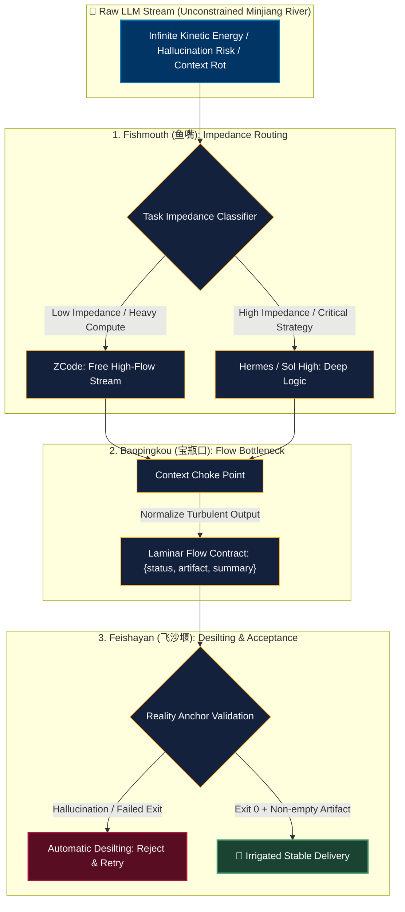

# AgentHub: Dujiangyan Harness Engineering Engine 🌊
> A bio-inspired, file-based harness for routing multi-agent work, constraining results, and checking evidence.

[](https://opensource.org/licenses/MIT)
[](https://www.python.org/downloads/)
[](#architecture)

[中文文档 (Chinese)](./README_CN.md) | [English Documentation](./README.md)

---

## 🌊 The Core Philosophy: "Agent - LLM = Harness"

In 256 BC, Chinese engineer Li Bing constructed the **Dujiangyan Irrigation System**. Instead of building a massive, rigid dam to block the raging Minjiang River, he designed a fluid, self-governing hydraulic harness that utilized gravity, centrifugal force, and natural river bends. It turned annual deadly floods into the eternal agricultural paradise of the Chengdu Plain.

Modern LLMs are just like the unconstrained Minjiang River: **infinite kinetic energy, high entropy, and prone to flooding (context rot, runaway loops, hallucination, out-of-memory crashes).**

Most multi-agent frameworks today are built like brittle dams (rigid DAGs, brittle state machines). When the model hallucinates, the dam bursts.

**AgentHub provides four composable harness patterns:**



```
                  [Raw LLM Kinetic Energy: Unconstrained Stream]
                                        │
                                        ▼
             ┌─────────────────────────────────────────────────────┐
             │    1. Fishmouth (鱼嘴): Task Impedance Routing       │
             │   Low-impedance crunching ──▶ ZCode (Free High-Flow)│
             │   High-impedance strategy ──▶ Hermes / Sol High     │
             └──────────────────────────┬──────────────────────────┘
                                        │
             ┌──────────────────────────┴──────────────────────────┐
             │    2. Baopingkou (宝瓶口): Information Choke Point    │
             │   Forces turbulent logs into 3-field laminar flow   │
             │   { status, artifact, summary }                     │
             └──────────────────────────┬──────────────────────────┘
                                        │
             ┌──────────────────────────┴──────────────────────────┐
             │    3. Feishayan (飞沙堰): Centrifugal Desilting      │
             │   Reality Anchors (Exit 0 + Non-empty artifact)     │
             │   80% noise/hallucination discarded automatically   │
             └──────────────────────────┬──────────────────────────┘
                                        │
                                        ▼
                   4. Sui Xiu (岁修): Self-Evolution & Dredging
                   Weekly cache purging & skill half-life pruning
```

---

## 🚀 Key Features

- **Task routing**: a transparent keyword-based example router for cheap, high-throughput work versus higher-judgment review.
- **Result shaping**: the **Baopingkou Choke** reduces worker output to a structured `{status, artifact, summary}` packet.
- **Evidence checks**: the **Feishayan Anchor** requires an expected artifact to exist and be non-empty before reporting success.
- **Event telemetry**: a file-based UAP event schema that a dashboard or external worker can consume.

---

## 🛠️ Quick Start

```bash
# Clone the repository
git clone https://github.com/your-username/agenthub.git
cd agenthub

# Run the isolated smoke test (uses a temporary directory and never deletes user data)
python3 skill/dujiangyan_harness.py test
```

### Output:
```text
🧪 Testing Dujiangyan Harness Engine Components...
1. Fishmouth Routing ──▶ Target: ZCode (Low impedance detected)
2. Baopingkou Choke  ──▶ Laminar Packet: {'status': 'SUCCESS', 'artifact': '...', 'summary': '...'}
3. Feishayan Anchor  ──▶ Status: PASSED (Physical file exists > 0 bytes)
4. Sui Xiu Dredging  ──▶ Cleaned 4 stale items
✅ All 4 Harness components verified without touching user data.
```

### Runtime directory and safe maintenance

AgentHub writes local runtime state to `~/.agenthub` by default. Set
`AGENTHUB_HOME` to isolate a project or CI run:

```bash
export AGENTHUB_HOME="$PWD/.agenthub"
python3 skill/scripts/dispatch_event.py TASK_DISPATCH hermes worker demo-task
```

`dredge` is dry-run by default. Deletion requires an explicit `--apply`:

```bash
python3 skill/dujiangyan_harness.py dredge
python3 skill/dujiangyan_harness.py dredge --apply
```

The bundled dashboard metrics are synthetic demo data. Runtime files and local
event streams are intentionally excluded from version control.

---

## 📜 License
MIT License. Built for autonomous self-improving single-person enterprises.
